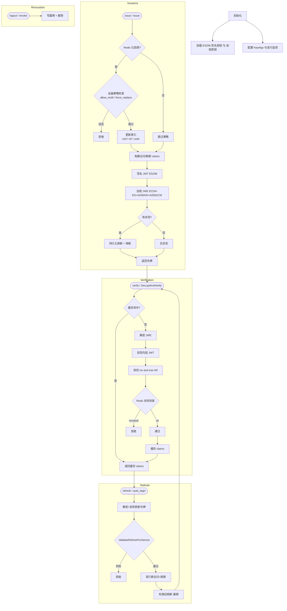

# JWE 令牌（嵌套 签名的 JWT（JWS）-> JWE）

> 本文是现有英文双语 README 的完整中文扩展版，聚焦高并发场景下的访问/刷新令牌发行、验证、轮换、撤销与设备会话控制。英文原文参见 `README.md`。

本库将 Access 与 Refresh 令牌以“签名的 JWT（JWS，ES256）后再使用 JWE（默认 ECDH-ES + A256KW + A256GCM，加密）包裹”的嵌套形式输出；可选 RSA-OAEP-256。支持：

- 基于 **Functional Options** 的发行 API（`Issue`、`AuthLogin`、`AutoLoginWithRefresh`）。
- 设备与跨设备会话策略（单设备多用户、强制顶号、跨设备单会话）。
- Redis 有状态：刷新令牌持久化、旋转、撤销墓碑、解析后 claims 缓存、设备索引。
- Redis 关闭时的纯加密“无状态”模式。
- JWE / 签名的 JWT（JWS） / 旧版不透明令牌统一验证入口。



## 目录

- 概览
- 快速开始
- 核心特性
- 算法与格式
- 架构与流程
- API 总览
- 设备与会话策略
- Redis 键模型
- 验证模式与不透明令牌替代
- 性能说明
- 生产环境建议
- Demo 接口
- 代码示例
- 模块路径调整
- FAQ
- License
- 变更日志

---
## 1. 概览

提供安全、紧凑、易缓存的 Access & Refresh 令牌；可可选启用服务端状态（刷新令牌/设备索引），并实现多端登录控制。可在“纯加密无状态”与“Redis 有状态”之间切换。

---
## 2. 快速开始

```powershell
go mod tidy
go run ./cmd/server
```

POST `/issue` 发起首次登录发行；若设置了 `REDIS_ADDR` 则进入有状态模式。

---
## 3. 核心特性

- 嵌套 签名的 JWT（JWS）-> JWE：同时具备完整性与机密性；访问令牌可选仅“签名的 JWT（JWS）”（无加密）。
- Functional Options：清晰组合参数/策略。
- 刷新令牌透明轮换（RID/FID 家族）与墓碑撤销防重放。
- 设备独占、多用户、跨设备顶号策略（`WithDeviceAllowMultiUser` / `WithForceReplace`）。
- Redis 缓存解析后的 claims 减少重复解密/验签成本。
- 统一验证入口：`VerifyAnyAccess` / `VerifyAnyRefresh` 自动判别 JWE/JWS/不透明。
- 可选 Mutator 在保存前调整 claims（不改变 JTI/RID/FID）。

---
## 4. 算法与格式

- 内层 签名的 JWT（JWS）：`ES256` (P-256)；Header: `typ=JWT`, `kid=<sig_kid>`
- 外层 JWE（默认）：`ECDH-ES + A256KW + A256GCM`；Header: `cty=JWT`, `kid=<enc_kid>`
- 可选 RSA：`RSA_OAEP_256 + A256GCM`
- 刷新 claims 包含：`RID`（刷新 ID）、`FID`（家族 ID，用于轮换）、`UID`、`DeviceID`、`ClientID`、`Scope`、标准 JWT 字段。

说明：`ES256` 仅是签名算法；JWE 部分使用 `ECDH-ES`（可附加 A256KW 进行密钥包裹）与内容加密算法 `A256GCM`。

---
## 5. 架构与流程

参考上方 Mermaid：发行 -> 验证 -> 刷新/轮换 -> 撤销，与策略控制节点。

---
## 6. API 总览

### 重要类型
- `AccessCustomClaims` / `RefreshCustomClaims`
- `KeyAlgs`（签名 / 密钥管理 / 内容加密算法组合）
- `IssueResult`（发行结果：旧/新 RID、令牌、claims、错误）
- `AuthSeed`（登录前最小身份种子）
- 错误：`ErrDeviceOccupied`、`ErrUserLoggedInElsewhere`、`ErrRefreshNotCurrent`、`ErrUserLoginForbidden`

### 发行相关（低层与高层）
- 低层：`IssueAccessAndRefreshJWE` / `IssueAccessAndRefreshJWEWithClaims`
- 高层：`Issue(ctx, store, ...IssueOption)` + 选项：
  - `WithKeys`、`WithSubject`、`WithAudience`、`WithClient`、`WithDevice`、`WithScope`、`WithTTL`
  - 策略：`WithForceReplace`、`WithDeviceAllowMultiUser`、`WithDeviceIndex`
- 登录包装：`AuthLogin` + `WithAuthStore`、`WithAuthIssueOptions`、`WithAuthTTL`、`WithAuthTTLFunc`、`WithAuthUIDValidator`
- 自动登录（刷新令牌静默换新）：`AutoLoginWithRefresh` + `WithAuto*` 系列

### 验证
- JWE 解密 + JWS 验签：`DecryptAndVerifyAccess`、`DecryptAndVerifyRefresh`
- 仅 签名的 JWT（JWS）：`VerifyAccessJWS`、`VerifyRefreshJWS`
- 自动判别：`VerifyAnyAccess`、`VerifyAnyRefresh`、`GuessTokenKind`

### 策略辅助
- `IsSameDeviceLoggedIn`（同设备是否已存在会话）
- `ValidateRefreshForDevice`（刷新令牌是否当前设备有效会话）

### 存储接口
- `RedisTokenStore` 实现 `TokenStore` + `DeviceIndexStore`
  - 刷新令牌保存/轮换（原子）
  - FID->RID 家族关系
  - Revocation tombstone（访问/刷新）
  - 解析 claims 缓存（按 token 哈希）
  - 设备索引：`uxd`（用户+设备）、`xd`（设备占用）、`uxds`（用户设备集合）

### 密钥工具
- `GenerateES256Key` / `GenerateRSA2048`

---
## 7. 设备与会话策略

| 选项 | 说明 |
|------|------|
| `WithDeviceAllowMultiUser(false)` | 设备独占（默认 true 允许多用户并行）|
| `WithForceReplace(true)` | 跨设备单会话：同一用户其他设备在线时顶号；false 时阻止新设备登录|
| 同设备重复登录 | 默认自动顶号，不需额外开关 |

辅助：`ValidateRefreshForDevice`（刷新是否最新）、`IsSameDeviceLoggedIn`（查询同设备状态）。

---
## 8. Redis 键模型

前缀可配置（示例使用 `auth:`）：

- `rtk:{rid}`：JSON(RefreshClaims) + TTL
- `fid:{fid}`：当前 RID（用于刷新轮换检测）
- `rev:a:{jti}`：访问令牌撤销墓碑
- `rev:r:{rid}`：刷新令牌撤销墓碑
- `rc-cache:{sha256(token)}`：解析后的刷新 claims 缓存
- `uxd:{uid}|{device}`：当前用户在该设备的 RID
- `xd:{device}`：设备占用（{uid,rid}）用于独占模式
- `uxds:{uid}`：用户的设备集合（Set）

TTL 来自令牌过期；墓碑避免删除后短暂重放。

---
## 9. 验证模式与不透明替代

`VerifyAnyAccess` / `VerifyAnyRefresh` 顺序：结构猜测 -> JWE -> 签名的 JWT（JWS） -> legacy decoder。若仅需最高性能可采用“随机不透明令牌 + Redis 映射全部 claims”方案（参考 OAuth2 reference token 模式），牺牲自包含换取 CPU 与即时撤销。

---
## 10. 性能说明

每次发行：1 次 ECDSA-P256 签名 + 1 次 JWE 加密（ECDH-ES 密钥协商 + AES-GCM）。验证做逆向操作。

优化建议：
- 重用 signer / encrypter 实例（减少对象构建）。
- 缩减 claims 字段长度（减小密文大小与序列化成本）。
- 利用解析缓存减少重复解密与验签。
- 若可接受明文（无机密需求），访问令牌考虑仅“签名的 JWT（JWS）”；刷新令牌保密。

---
## 11. 生产环境建议

- 分离签名与加密密钥集合（JWKS：`use=sig` / `use=enc`），定期轮换 `kid`。
- 固定算法白名单；拒绝未授权 `alg`。
- 控制 TTL 上限，监测异常频繁的刷新轮换。
- 对刷新接口做速率限制与审计（特别是跨设备顶号）。
- 记录撤销与强制替换事件（安全审计）。
- 若跨多服务，统一 Redis 前缀或使用逻辑分片。

---
## 12. Demo 接口说明

- `POST /issue`：基础发行（Redis 可选）。
- `POST /issue_policy`：带设备策略的发行（`allow_multi`、`force_replace`）。
- `POST /verify`：验证 access 或 refresh（`type=access|refresh`）。
- `POST /refresh`：刷新并轮换旧 refresh。
- `POST /auto_login`：使用刷新令牌静默登录（发新对）。
- `POST /refresh_policy`：带设备策略的刷新校验。
- `POST /logout`：撤销（指定 token/JTI/RID）。
- `POST /revoke`：写墓碑撤销。
- `POST /device_status`：查询同设备是否存在当前会话。

示例 `/issue` 请求：
```json
{
  "uid": "u123",
  "sub": "u123",
  "aud": "api://local",
  "iss": "https://auth.local",
  "device_id": "dev1",
  "client_id": "web",
  "scope": ["read"],
  "access_ttl_minutes": 10,
  "refresh_ttl_days": 14
}
```

策略额外字段：
```json
{
  "allow_multi": true,
  "force_replace": false
}
```

---
## 13. 代码示例

### 发行（Redis + 设备策略）
```go
algs := tokens.KeyAlgs{SignAlg: jose.ES256, KeyMgmtAlg: jose.ECDH_ES_A256KW, ContentEncryption: jose.A256GCM}
res := tokens.Issue(ctx, store,
    tokens.WithKeys(signKid, signPriv, encKid, &encPubKey, algs),
    tokens.WithAudience(iss, aud),
    tokens.WithSubject(uid, sub),
    tokens.WithDevice(deviceID),
    tokens.WithClient(clientID),
    tokens.WithScope("read"),
    tokens.WithTTL(10*time.Minute, 14*24*time.Hour),
    tokens.WithDeviceAllowMultiUser(false), // 设备独占
    tokens.WithForceReplace(true),          // 跨设备单会话
)
if res.Err != nil { panic(res.Err) }
fmt.Println(res.AccessJWE, res.RefreshJWE)
```

### 静默自动登录（刷新令牌换新）
```go
newAccess, newRefresh, ac, rc, err := tokens.AutoLoginWithRefresh(
    ctx,
    tokens.WithAutoStore(store),
    tokens.WithAutoDecryptKey(encPriv),
    tokens.WithAutoFindSigKey(findSigKeyByKID),
    tokens.WithAutoKeys(signKid, signPriv, encKid, &encPubKey, algs),
    tokens.WithAutoAudience(iss, aud),
    tokens.WithAutoTTL(10*time.Minute, 14*24*time.Hour),
    tokens.WithAutoRefreshToken(oldRefresh),
)
```

### 统一验证（自动判别格式）
```go
claims, err := tokens.VerifyAnyAccess(token, encPriv, findSigKeyByKID, iss, aud, legacyDecoder)
```

### 校验刷新令牌是否当前设备最新
```go
if err := tokens.ValidateRefreshForDevice(ctx, dstore, refreshClaims); err != nil {
    // 拒绝：已被新会话替换
}
```

### 不透明令牌策略示例
随机 32 字节 ID -> Redis `opaque:{id}` 保存 JSON(claims) TTL=exp，访问时直接查 Redis 而非解密验签。

---
## 14. 模块路径调整

修改 `go.mod`：
```go
module github.com/yourorg/tokens
```
然后：
```powershell
go mod tidy
go build ./...
go test ./...
```

---
## 15. FAQ

**Q: 为什么使用嵌套 JWE?** 需要对 claims 做机密保护（例如 device/client/scope），同时保持签名完整性与算法分离。

**Q: 为什么访问令牌可以无状态，而刷新令牌有状态?** 访问令牌短 TTL 减少存储压力；刷新令牌提供会话持续性与轮换撤销点。

**Q: 如何切换到 RSA?** 替换 `KeyAlgs.KeyMgmtAlg` 为 `jose.RSA_OAEP_256`，加密公钥使用 `*rsa.PublicKey`，解密用对应私钥。

**Q: tombstone 有什么作用?** 防止删除后在缓存/延迟传播窗口出现旧令牌重放；写入短 TTL 标记使服务快速拒绝。

**Q: 是否需要同时撤销访问令牌?** 通常访问令牌较短，可以只撤销刷新；若需即时吊销访问令牌，可存 JTI 并写 revocation tombstone。

---
## 16. License

内部使用/待补充。如需开源请选择合适的许可证（MIT、Apache-2.0 等）。

---
## 17. 变更日志（要点）

- 引入 Functional Options 发行 API (`Issue`, `AuthLogin`, `AutoLoginWithRefresh`).
- 增加设备索引与多/跨设备策略。
- 增加解析 claims 缓存与 `VerifyAny*` 统一入口。
- 增加刷新令牌家族轮换（RID/FID + 原子操作）。

---
意见反馈欢迎提出。安全高效使用愉快！
