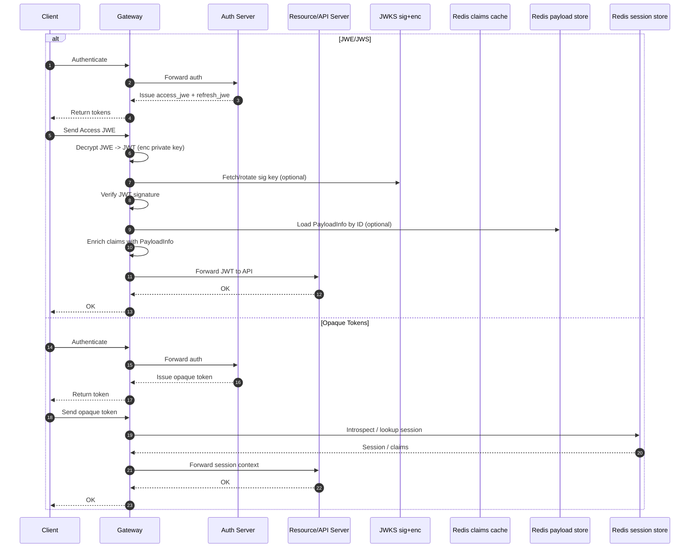

# Auth: JWE vs Opaque Tokens

本文用一张架构图对比基于 JWE/JWS 的自包含令牌与 Opaque 引用令牌（服务端会话）的差异与优势，并给出适用场景。

## 说明（签发与网关职责）

- Auth 签发：Auth 使用签名私钥（sign private key）对 claims 生成 JWS；随后使用加密公钥（enc public key）将该 JWS 加密为 JWE，并通过 Gateway 返回给前端。
- Gateway 校验与富化：Gateway 使用加密私钥（enc private key）将 Access JWE 解密成 JWS，使用 JWKS 中的签名公钥校验 JWS；如需从 Redis 读取 PayloadInfo（例如外置的业务字段），Gateway 将其与 JWS claims 合并，生成内部下游可用的 JWT/上下文再转发给 API 服务。

## TL;DR 优势（JWE 相对 Opaque）

- 自包含校验：资源服务本地解密+验签即可完成鉴权；不依赖集中存储，延迟稳定、可离线运行。
- 机密性：JWE 对载荷加密，避免在网络、代理或日志中泄露敏感字段（PII、scope 等）。
- 高可用/扩展性：去中心化，无需每次请求访问 Redis/DB；横向扩展只需分发公钥/JWKS。
- 算法与密钥轮换：通过 `kid` 与 JWKS 管理 sig/enc 双键，便于灰度和回滚；可选 ECDH-ES + A256GCM。
- 边缘友好：CDN/边缘节点可就地校验，无需回源内网会话库。
- 故障隔离：Redis 故障不影响已签发访问令牌的校验路径（可配合本地缓存降低 CPU）。

## 何时考虑 Opaque

- 强一致撤销：需“即刻撤销/登出立刻生效”，服务端会话可精准控制有效性。
- 极致 CPU 友好：避开解密/验签成本（用随机 ID + Redis 取会话）。
- 丰富会话：需要在服务端频繁更新/附加动态状态（风控分、地理位置信号等）。

## 推荐实践（混合）

- 访问令牌用 JWE/JWS（短 TTL，偏无状态）；刷新令牌可用 Opaque（长 TTL，强管控、可撤销）。
- 在资源服务增加“已解析 claims 缓存”（命中即跳过解密/验签），TTL 不超过令牌过期。
- 对高敏感场景，启用算法白名单、`kid` 轮换、双 JWKS（`use=sig`/`use=enc`）。

