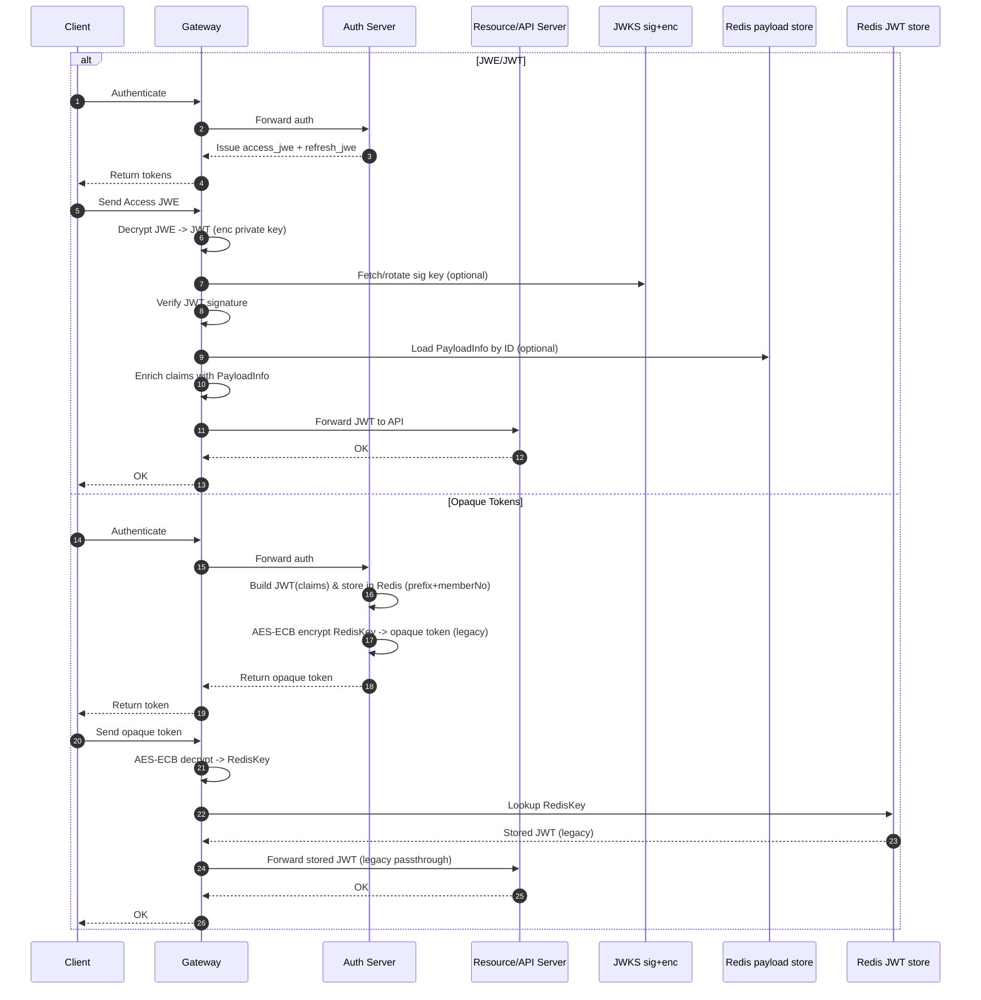

# Auth: JWE vs Opaque Tokens

以下张架构图对比基于 JWE/JWT 的自包含令牌与 Opaque 引用令牌（服务端会话）的差异与优势。

## 说明

- Auth 签发：
  - Auth 使用签名私钥（sign private key）对 claims 生成 JWT；
  - 随后使用加密公钥（enc public key）将该 JWT 加密为 JWE，并通过 Gateway 返回给前端。
- Gateway 校验与富化：
  - Gateway 使用加密私钥（enc private key）将 Access JWE 解密成 JWT，使用 JWKS 中的签名公钥校验 JWT；
  - 从 Redis 读取 PayloadInfo（外置的业务字段），Gateway 将其与 JWT claims 合并，生成内部下游可用的 JWT/上下文再转发给 API 服务。

### JWE/JWT 流程步骤

1. 客户端向 Gateway 发起认证请求 (Authenticate)。
2. Gateway 将认证请求转发给 Auth Server (Forward auth)。
3. Auth Server 签发 `access_jwe` 与 `refresh_jwe` 返回给 Gateway (Issue access_jwe + refresh_jwe)。
4. Gateway 将两个令牌返回客户端 (Return tokens)。
5. 客户端携带 Access JWE 调用 Gateway (Send Access JWE)。
6. Gateway 使用加密私钥解密 JWE 得到内部 JWT (Decrypt JWE -> JWT)。
7. Gateway（必要时）通过 JWKS 拉取或轮换签名公钥 (Fetch/rotate sig key, optional)。
8. Gateway 使用签名公钥验证 JWT 签名 (Verify JWT signature)。
9. Gateway（可选）从 Redis 载入 PayloadInfo (Load PayloadInfo by ID, optional)。
10. Gateway 合并 PayloadInfo 与 JWT claims 丰富上下文 (Enrich claims with PayloadInfo)。
11. Gateway 将内部 JWT/上下文转发给资源 API 服务 (Forward JWT to API)。
12. 资源/API 服务处理完成返回 OK 给 Gateway (RS OK)。
13. Gateway 将成功响应返回客户端 (OK)。

### Opaque Token 流程步骤（旧版实现）

1. 客户端向 Gateway 发起认证请求 (Authenticate)。
2. Gateway 转发认证到 Auth Server (Forward auth)。
3. Auth Server 构造 JWT(业务 claims) 并写入 Redis：Key = `prefix+memberNo` (Store JWT payload)。
4. Auth Server 使用 AES-ECB 对该 Redis Key 加密生成 opaque token (Encrypt RedisKey -> opaque token)。
5. Auth Server 返回 opaque token 给 Gateway (Return opaque token)。
6. Gateway 将令牌返回客户端 (Return token)。
7. 客户端携带 opaque token 调用 Gateway (Send opaque token)。
8. Gateway 使用 AES-ECB 解密令牌得到 Redis Key (Decrypt opaque token -> RedisKey)。
9. Gateway 在 Redis 查找该 Key 直接获取存储的 JWT (Lookup RedisKey -> stored JWT)。
10. Gateway 直接将该存储的 JWT 透传给资源 API 服务 (Forward stored JWT)。
11. 资源/API 服务处理完成返回 OK 给 Gateway (RS OK)。
12. Gateway 将成功响应返回客户端 (OK)。

## JWE 相对 Opaque 的优势

| 优势 | 描述 |
| ---- | ---- |
| 自包含校验 | 资源服务本地解密+验签即可完成鉴权；不依赖集中存储，延迟稳定、可离线运行。 |
| 机密性 | JWE 对载荷加密，避免在网络、代理或日志中泄露敏感字段（PII、scope 等）。 |
| 高可用/扩展性 | 去中心化，无需每次请求访问 Redis/DB；横向扩展只需分发公钥/JWKS。 |
| 算法与密钥轮换 | 通过 `kid` 与 JWKS 管理 sig/enc 双键，便于灰度和回滚。 |
| 边缘友好 | CDN/边缘节点可就地校验，无需回源内网会话库。 |
| 故障隔离 | Redis 故障不影响已签发访问令牌的校验路径（可配合本地缓存降低 CPU）。 |

## 安全对比

### 旧版 Opaque Token（不安全实现示例）

实现流程：将包含多字段的 PayloadInfo 直接生成一个 JWT 存入 Redis，Redis Key = `prefix + memberNo`；随后对该 Redis Key 做 AES ECB 加密，其密文暴露给客户端作为“Opaque Token”。

主要问题：

| 问题 | 风险描述 | 影响 |
| ---- | -------- | ---- |
| 模式泄露 | AES ECB 无随机化，相同 `prefix+memberNo` 产生可重复密文块，易被模式分析与字典枚举 | 可推断内部 key 规律与用户分布，降低暴力成本 |
| 可枚举性 | 前缀固定且 memberNo 空间有限，攻击者可离线批量生成候选并比对真实密文 | 用户集合被枚举、批量滥用或撞库加速 |
| 信息侧漏 | 密文长度与块结构与明文长度直接相关，泄露 memberNo 长度分布与结构 | 侧信道辅助识别高价值账户或分段含义 |
| 无载荷机密性 | claims 仅在 Redis 明文；令牌本身不承载也不保护敏感字段 | Redis 泄露即大规模会话/PII 泄露，横向移动风险上升 |
| 缺少完整性 (AEAD) | ECB 不检测块重排/剪贴，可能被构造拼接伪造密文 | 潜在伪造/绕过校验导致未授权访问 |
| 轮换困难 | Key 设计与加密输出耦合，轮换需兼容旧密文解析与新加密 | 推迟轮换，增加长生命周期密钥暴露窗口 |
| 审计困难 | 令牌不自描述，缺失 iat/exp/kid/jti 等元数据 | 难以追踪滥用、做溯源与合规审计 |

### 问题与 JWE 对应解决（结合当前代码实现）

| 旧问题 | 解决方案概述 | 关键机制/说明 |
| ------ | ------------- | ------------- |
| 模式泄露 | 使用标准 JWE 嵌套 JWS，生成随机 CEK + IV | jose 库每次加密生成随机内容密钥与 IV；五段结构避免重复块模式（无 ECB）。 |
| 可枚举性 | 高熵随机 UUID 作为 `Claims.ID`/`RID`/`FID` | 外部只见 JWE 密文；内部标识为随机 UUID，无法通过前缀枚举 memberNo。 |
| 信息侧漏 | 整个签名后的 JWS 作为 JWE 密文 | 明文 claims 不暴露；长度稳定不再泄露字段数量/长度侧信道（未使用压缩避免压缩攻击）。 |
| 无载荷机密性 | 业务 claims 放入签名 JWT 后整体加密 | 只有持私钥的服务可解密；Redis 仅保存刷新会话且可外置扩展 payload。 |
| 缺少完整性 (AEAD) | 使用 AEAD 内容加密算法 (如 A256GCM) | AEAD 同时保证机密性+完整性；解密失败即拒绝，被篡改密文无法通过解密。 |
| 轮换困难 | Header `kid` 标识支持并行轮换 | 新旧密钥并存；验证端按 `kid` 取公钥，旧令牌自然过期，无需批量迁移。 |
| 审计困难 | 自描述标准字段 `iat`,`exp`,`nbf`,`jti` | 可做时序分析、过期控制、重放检测 (JTI 黑名单) 与家族管理 (RID/FID)。 |
| 重放风险 (新增) | 按 JTI/RID/FID 建立撤销与旋转控制 | 黑名单 tombstone 防止已撤销令牌重放；原子旋转防止旧 refresh 被复用。 |
| 跨设备失控 (新增) | 设备索引与占用校验保持当前 refresh 唯一性 | 每设备当前 RID 追踪，防止旧会话在同/异设备复用，提高会话治理能力。 |

